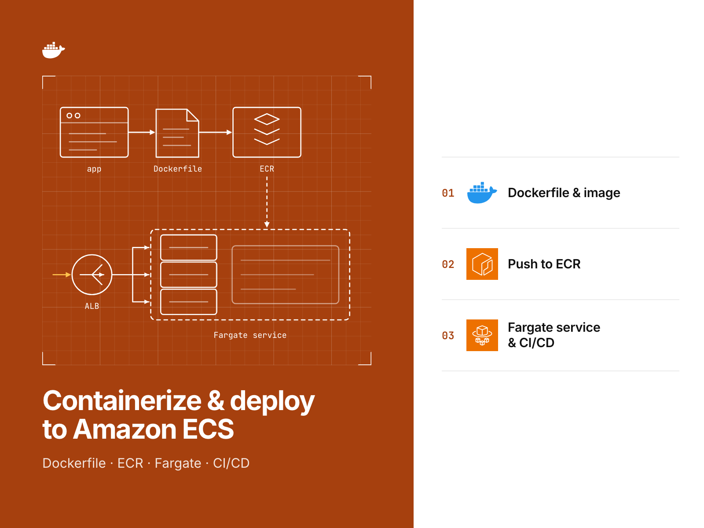
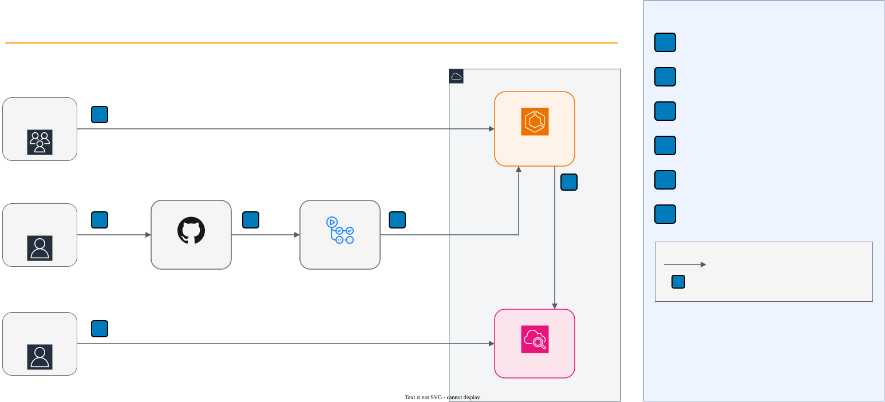

# aws-ecs-fargate-deploy-lab

A small API packaged as a hardened container image and deployed to Amazon ECS on Fargate, defined in Terraform and
checked offline.

[](https://github.com/gamaware/aws-ecs-fargate-deploy-lab/actions/workflows/ci.yml)
[](LICENSE)




## What this proves

- **Containerizing an app:** a TypeScript API moves to a multi-stage build on a distroless, non-root image. The image
  holds no shell and no compiler, has zero fixable HIGH or CRITICAL CVEs, and a smoke test runs it under the same
  constraints as the ECS task.
- **The ECS platform as code:** VPC, HTTPS load balancer with AWS WAF, Fargate service on ARM64 in private subnets
  with no internet egress, CPU and request autoscaling, CloudWatch logs, alarms and a dashboard, all in Terraform.
- **Safe releases:** the deployment circuit breaker and CloudWatch alarms roll back a bad release on their own, and
  one variable switches to blue/green through AWS CodeDeploy.
- **An artifact you can trace:** the image is built once, scanned, pushed and deployed by `sha256` digest. Terraform
  rejects any image reference by tag.
- **Tested without an AWS account:** 17 app tests, 15 mocked `terraform test` runs, Checkov, Trivy and hadolint, all
  behind one `make verify`.

## Inspect the deliverable

| Artifact | Why look |
| --- | --- |
| [`app/Dockerfile`](app/Dockerfile) | Two stages, digest-pinned bases, tests run inside the build, distroless runtime |
| [`app/src/main.ts`](app/src/main.ts) | SIGTERM handling that drains through `/ready` before exit |
| [`infra/terraform/service/ecs.tf`](infra/terraform/service/ecs.tf) | Task definition hardening, circuit breaker, alarm rollback |
| [`infra/terraform/service/tests/`](infra/terraform/service/tests) | What the infrastructure must guarantee, as assertions |
| [`.github/workflows/deploy.yml`](.github/workflows/deploy.yml) | Build once, scan, push by digest, deploy |
| [`scripts/smoke-test.sh`](scripts/smoke-test.sh) | The image under ECS constraints: read-only, non-root, no capabilities |
| [`docs/runbook.md`](docs/runbook.md) | Deploy, roll back, scale, investigate, hand over |

## Scenario and acceptance criteria

Harbor Goods, a fictional mid-size retailer, runs a stock lookup API on a single virtual machine. Releases are manual
file copies, and a bad release stays up until someone notices. They want it on AWS without servers to patch, rebuilt
from code, and released without downtime.

Constraints: one AWS account and Region, HTTPS on the company domain, no long-lived AWS keys in CI, and a team that
reads Terraform.

| Acceptance criterion | How it is met | Checked by |
| --- | --- | --- |
| Image runs as non-root, read-only, with no shell | Distroless `nonroot` runtime, `readonlyRootFilesystem`, capabilities dropped | `make smoke`, `terraform test` |
| No fixable HIGH or CRITICAL vulnerabilities ship | Trivy gate before push | `make trivy`, deploy workflow |
| Tasks are not reachable from the internet and cannot reach it | Private subnets, no NAT, VPC endpoints, ALB-only ingress | `terraform test`, Checkov |
| A failing release rolls back without a person | Circuit breaker with rollback plus alarm rollback | `terraform test`, `verify-deployment.sh` |
| What runs is exactly what was scanned | Deploy by digest; image ID check between jobs | `terraform test` validations, deploy workflow |
| Scales between 2 and 6 tasks | Target tracking on CPU and requests per target | `terraform test` |

## Architecture



Customers call the API over HTTPS. Engineers change it through GitHub, and a GitHub Actions pipeline builds, scans
and deploys it with short-lived OIDC credentials. Operators watch a CloudWatch dashboard and alarms. Inside AWS,
AWS WAF filters traffic in front of an Application Load Balancer. Fargate tasks run in private subnets across two
Availability Zones and reach ECR, S3 and CloudWatch Logs only through VPC endpoints.

Deeper views: [runtime architecture](docs/diagrams/02-container.svg) and
[delivery pipeline](docs/diagrams/03-delivery.svg). Sources are the `.drawio` files next to them.

## Verify locally

Prerequisites (versions used to verify this repo):

| Tool | Version |
| --- | --- |
| Node.js | 24 or later |
| Docker | 29 (ARM64 host or emulation) |
| Terraform | 1.14.5 |
| tflint | 0.61.0 (AWS ruleset 0.49.0, fetched by `tflint --init`) |
| Checkov | 3.2 or later |
| Trivy | 0.74.0 |
| hadolint | 2.15.1 |

```bash
make verify
```

The run needs no AWS credentials and makes no AWS API calls. The first run downloads npm packages, Terraform
providers, the tflint ruleset, the base images and the Trivy database. After that it takes about a minute. The last
line reads `make verify: all checks passed`. `make help` lists the individual targets.

A real deployment test is available as `make test-live`. It is manual, runs against the maintainer's `dev` profile, tags
everything and tears it all down. See [docs/live-test.md](docs/live-test.md).

## Repository map

```text
app/                    TypeScript API, tests, multi-stage Dockerfile
infra/terraform/
  registry/             ECR repository + KMS key (own state)
  service/              VPC, ALB, WAF, ECS, autoscaling, alarms, CodeDeploy option (own state)
    tests/              mocked terraform test suites
scripts/                smoke test, deploy, post-deploy verification, live test
docs/
  adr/                  architecture decision records
  diagrams/             .drawio sources with SVG and PNG exports
  runbook.md            operating guide
  live-test.md          manual end-to-end test
.github/workflows/      ci.yml (shared checks + app job), deploy.yml, scorecard.yml
Makefile                one entry point for local and CI runs
```

## Decisions and trade-offs

| Number | Title | Status |
| --- | --- | --- |
| [0001](docs/adr/0001-distroless-multi-stage-image.md) | Multi-stage build onto a distroless Node.js runtime | Accepted |
| [0002](docs/adr/0002-two-stacks-registry-and-service.md) | Separate Terraform stacks for the registry and the service | Accepted |
| [0003](docs/adr/0003-private-tasks-with-vpc-endpoints.md) | Private tasks with VPC endpoints instead of a NAT gateway | Accepted |
| [0004](docs/adr/0004-rolling-with-circuit-breaker-by-default.md) | Rolling deployments with the circuit breaker and alarms by default | Accepted |
| [0005](docs/adr/0005-codedeploy-blue-green-as-an-option.md) | Blue/green through CodeDeploy as an option | Accepted |
| [0006](docs/adr/0006-build-once-deploy-by-digest.md) | Build once, scan, push by digest, deploy that digest | Accepted |
| [0007](docs/adr/0007-arm64-tasks.md) | ARM64 (Graviton) tasks | Accepted |

## Security and quality gates

| Gate | Runs in | Why |
| --- | --- | --- |
| App unit tests and shutdown test | `make app-test`, CI `app` job, Docker build stage | The API contract and the SIGTERM drain ECS relies on |
| Smoke test | `make smoke`, CI `app` job (ARM64 runner) | The built image works under the task's restrictions |
| hadolint | `make hadolint`, pre-commit, shared `container` workflow | Dockerfile practices |
| Terraform fmt, validate, tflint, `terraform test` | `make tf-verify`, shared `terraform` workflow | Syntax, AWS-specific lint, and the guarantees in the acceptance table |
| Checkov | `make checkov`, shared `security` workflow | Policy checks on Terraform, the Dockerfile and workflows; skips carry reasons in the code |
| Trivy config and image | `make trivy`, shared `security` and `container` workflows, deploy workflow | Misconfigurations and fixable HIGH or CRITICAL CVEs |
| Semgrep | shared `security` workflow | Static analysis of the code, Dockerfile, Terraform and workflows |
| gitleaks, detect-secrets | pre-commit, shared `secrets` workflow | No credentials in the history |
| actionlint, zizmor | pre-commit, shared `lint-actions` workflow | Workflow correctness and hardening |
| OpenSSF Scorecard | `scorecard.yml` | Repository supply-chain posture |

`ci.yml` is a thin caller: the shared checks come from reusable workflows in
[gamaware/.github](https://github.com/gamaware/.github). Workflows start from `permissions: {}`, pin actions by SHA and
set timeouts. Pull request jobs get no cloud access.

## Limits and production adaptations

- **Simulated:** no AWS account backs this repo's CI. The Terraform tests prove configuration intent against a mocked
  provider. They cannot prove IAM permissions, quotas, or that the service reaches a steady state; `make test-live`
  does that by hand.
- **Out of scope:** the GitHub OIDC provider and deploy role (see `github-actions-aws-oidc-lab`), DNS records, the
  real ACM certificate, and the Terraform state bucket.
- **A real engagement adds:** a database or cache with credentials in AWS Secrets Manager, separate dev and prod
  accounts or state, an SNS topic for `alarm_actions` wired to on-call, WAF rules tuned from real traffic, and ECS
  built-in blue/green instead of CodeDeploy for a new service (ADR 0005).
- **Cost to run:** roughly USD 90 to 110 a month in `us-east-1` at the defaults (load balancer, two 0.25 vCPU ARM64
  tasks, three interface endpoints in two zones, AWS WAF, KMS and logs), before traffic charges.

## Related work

Part of the [AWS DevOps portfolio](https://github.com/gamaware/aws-devops-portfolio), under the service
"Containerize and deploy to ECS Fargate". The pipeline side, keyless deploy roles and security gates, is covered in
[github-actions-aws-oidc-lab](https://github.com/gamaware/github-actions-aws-oidc-lab).

## License

[MIT](LICENSE)
